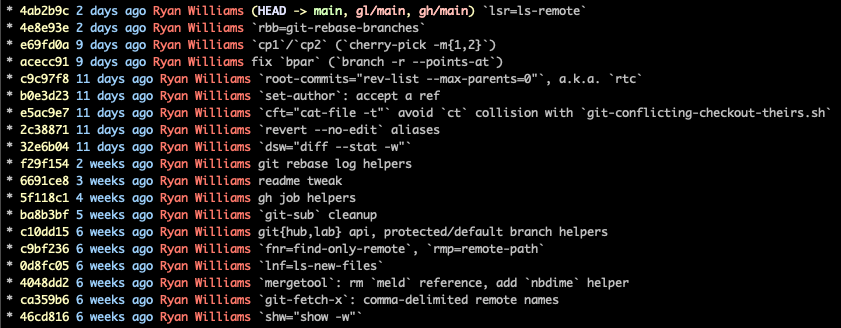
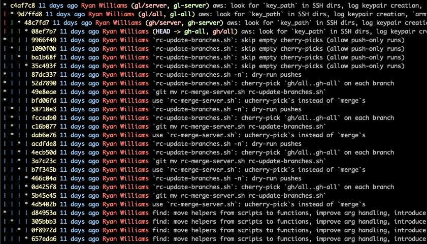
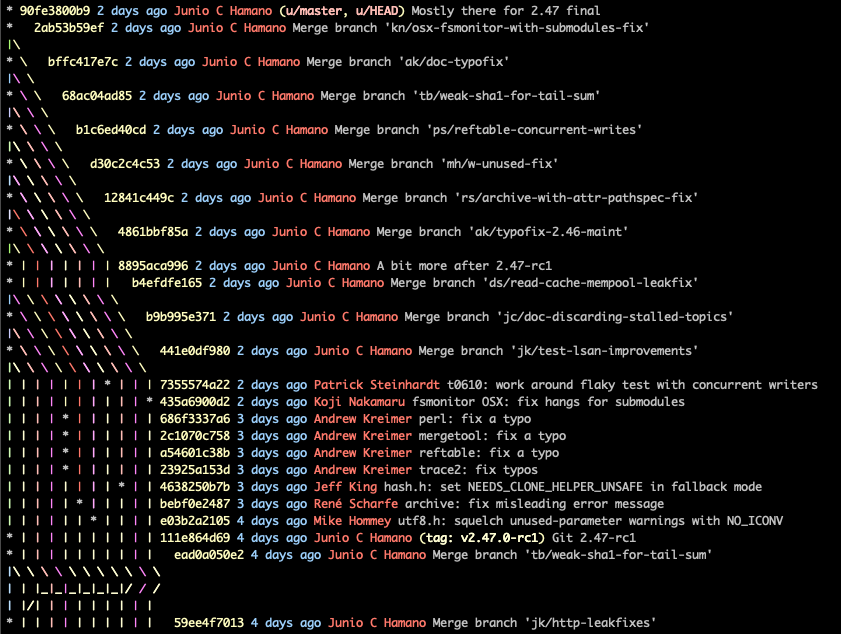
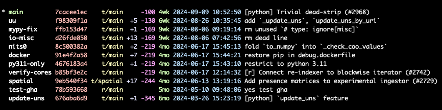

# git-helpers
[1,841](#count-completions) Git aliases and scripts.

<!-- toc -->
- [Setup](#setup)
- [Commands](#commands)
    - [Inspect commit graph](#graphs)
        - [`ggr` (`git-graph`)](#ggr)
        - [`gg` (`git-graph-all`)](#gg)
    - [Summarize local/remote branches](#branches)
        - [`gb` (`git branches`)](#gb)
        - [`gbr` (`git remote-branches`)](#gbr)
    - [Inspect commits being rebased/cherry-picked](#gshrh)
        - [`grbh` (`git-rebase-head`), `gcph` (`git-cherry-pick-head`)](#grbh)
        - [`gshrh` (`git-show-rebase-head`), `gshch` (`git-show-cherry-pick-head`)](#gshrh)
    - [Rebase](#rebase)
        - [`gtw` (`git-throw`)](#gtw)
        - [`groc` (`git-reorder-commits`)](#groc)
        - [`grbci` (`git-rebase-preserve-commit-info`)](#grbci)
        - [`gec` (`git-edit-commit`)](#gec)
        - [Other](#rebase-other)
    - [Diff helpers, GIFs, JSON](#diff)
        - [`gdg` (`git-diff-gif.py`)](#gdg)
        - [`gdj` (`git-diff-json.py`)](#gdj)
    - [Update commit parents](#parents)
    - [Query GitHub Actions runs](#gh-run-list)
    - [Set/unset "attr" types](#gsat)
- [Meta](#meta)
    - [Alias count](#count-completions)
    - [Alias histogram](#aliases)
<!-- /toc -->

## Setup <a id="setup"></a>
Source [`.git-rc`](./.git-rc) in your `.bashrc`:
```bash
echo ". $PWD/.git-rc" >> ~/.bashrc  # Configure new shells to load `git-helpers`
. .bashrc                           # re-"source" your .bashrc, for immediate effect in existing shells
```
This will load all aliases from this repo, add relevant directories to `$PATH`, and set up `PYTHONPATH` for Python utilities.

`pip install -r requirements.txt` ensures `python-dateutil` is installed, which some scripts here require.

### Optional: GitHub PR/Issue Management

The shell integrations include aliases for [`ghpr`], a CLI tool for managing GitHub PRs and Issues locally with bidirectional sync and gist mirroring. Install it separately via:

```bash
pipx install ghpr-py
```

See the [ghpr documentation] for more details.

[ghpr documentation]: https://github.com/runsascoded/ghpr

### Optional: Diff-of-Diffs Tool

The shell integrations include aliases for [`git-didi`], a CLI tool for comparing patches between Git ranges (diff-of-diffs). Install it separately via:

```bash
pipx install git-didi
```

See the [git-didi documentation] for more details.

[`git-didi`]: https://github.com/ryan-williams/git-didi
[git-didi documentation]: https://github.com/ryan-williams/git-didi


## Commands <a id="commands"></a>
Some aliases/commands I use frequently:

### Inspect commit graph <a id="graphs"></a>
`ggr` ([`git-graph`]) and `gg` ([`git-graph-all`]) are my preferred ways to visualize Git branches and history.

#### `ggr` ([`git-graph`]) <a id="ggr"></a>

Example output from this repo:



The first line shows that local branch `main` is checked out (`HEAD -> main`), and up to date with remote branches `gh/main` and `gl/main` (GitHub and GitLab, resp., but that's just a convention I use).

#### `gg` ([`git-graph-all`]) <a id="gg"></a>
Same as [`ggr`](#ggr), but includes all branches (not just the current one).

e.g., [runsascoded/.rc] shows several parallel branch lineages I maintain:



I develop on `gh-all`, and cherry-pick commits over to `gh-server`, `gl-all`, and `gl-server`.

[git/git] shows wide merge lineages



### Summarize local/remote branches <a id="branches"></a>

#### `gb` ([`git branches`]) <a id="gb"></a>

Improved version of `git branch -vv`:
- Branches output in reverse-chron order of last modification (instead of alphabetically)
- Nice colors for each field
- Concise "commits ahead/behind" counts
- Abbreviated "time since last commit"

[TileDB-SOMA] example:



#### `gbr` ([`git remote-branches`]) <a id="gbr"></a>

Similar to [`gb`](#gb), but summarizes remotes' branches.

### Inspect commits being rebased/cherry-picked <a id="gshrh"></a>

#### `grbh` ([`git-rebase-head`]), `gcph` ([`git-cherry-pick-head`]) <a id="grbh"></a>
Print the SHA of the commit currently being rebased or cherry-picked.

#### `gshrh` ([`git-show-rebase-head`]), `gshch` ([`git-show-cherry-pick-head`]) <a id="gshrh"></a>
Pass the above SHAs to `git show`.

### Rebase <a id="rebase"></a>

#### `gtw` ([`git-throw`]) <a id="gtw"></a>
"Throw" (squash) uncommitted changes onto an arbitrary previous commit.

<!-- `bmdf git-throw.py -- --help` -->
```bash
git-throw.py --help
# Usage: git-throw.py [OPTIONS] DST
#
#   "Throw" (squash) uncommitted changes onto an arbitrary previous commit.
#
# Options:
#   -a, --all           Stage all tracked files before committing (pass -a to
#                       git commit).
#   -m, --message TEXT  Optional message to use for ephemeral commit (before it
#                       is squashed onto the commit pointed to by `dst`).
#   -n, --dry-run       1x: commit changes, print rebase todo list; 2x: don't
#                       commit changes, show simulated rebase todo list
#   --help              Show this message and exit.
```

See also:
- `gtwp` (`git throw HEAD^`): squash staged changes onto the current commit's parent.
- `gtwp2` (`git throw HEAD~2`): squash staged changes onto the current commit's grandparent.

#### `groc` ([`git-reorder-commits`]) <a id="groc"></a>
- Reorder commits by index (0-based, counting backwards from `HEAD`)
- The rebase starts just before the largest index provided, and "picks" commits in the order provided.

Examples:

##### Swap order of last two commits
```bash
groc 0 1
```
This rebases the last **2** commits (one more than the maximum index provided, i.e. **1**), according to the plan "0 1":
- "pick" `HEAD~0` (current `HEAD`, whose rebased parent becomes `HEAD~2`)
- "pick" `HEAD~1` (originally the parent of `HEAD`, now rebased on top of the commit from the previous step)

##### `-n`: view a rebase "plan" without executing it
```bash
groc -n 0 1
# pick 3d2e3a8 `dcw="diff --cached -w"`
# pick 2d551a6 `commit -F-` aliases
```

##### `-p`: preserve commit-dates
```bash
groc -p -n 0 1
# pick 3d2e3a8 `dcw="diff --cached -w"`
# exec git reset-committer-date-rebase-head
# pick 2d551a6 `commit -F-` aliases
# exec git reset-committer-date-rebase-head
```
In this case, calls to [`git reset-committer-date-rebase-head`] are inserted after each `pick`ed commit.

The `rebase -x` flag is also directly available; this does the same as the above:

```bash
git roc -n -x 'g rcr' 0 1
# pick 3d2e3a8 `dcw="diff --cached -w"`
# exec g rcr
# pick 2d551a6 `commit -F-` aliases
# exec g rcr
```

(`g rcr` is an alias for [`git reset-committer-rebase-head`])

##### No-op rotations
Running it twice is a no-op (assuming there are no rebase conflicts):
```bash
groc -p 0 1  # Reverse order of last two commits
groc -p 0 1  # Reverse back, original commit SHA
```

Similarly, here's a no-op 3-rotation:
```bash
groc -p 0 2 1  # Put current HEAD before prior two commits
groc -p 0 2 1  # Repeat; current state same as `groc -p 1 0 2`
groc -p 0 2 1  # Original commit is restored (including SHA)
```

#### `grbci` ([`git-rebase-preserve-commit-info`]) <a id="grbci"></a>
Rebase, but inject `-x git rcr` ([`git reset-committer-rebase-head`]) after each commit, so that the committer-time is preserved.

#### `gec` ([`git-edit-commit`]) <a id="gec"></a>
Run a rebase to `edit` or `reword` a specific commit:

```bash
# Open the 3th commit back from HEAD, in rebase "edit" mode.
# A subsequent `rebase --continue` will rebase the remaining 3 commits on top of it.
git edit-commit HEAD~3

# "Dry run" of the above:
git edit-commit -n HEAD~3
# Would run git rebase -i d6aae97^:
# edit d6aae97 rm orphaned(?) `commit-filename{,s}` aliases
# pick ed9447b `cmba="commit-body -a"`, `cnb="commit-body --amend"`
# pick df33af4 `git-diff-json.py` fixes
# pick 3c166c3 `dtl`/`details`: commit details

# Change the parent commit's message, rebase HEAD on top of it (noninteractive)
git edit-commit -m "new message" HEAD^

# Same as above, but preserve the "committer dates" of `HEAD^` and `HEAD`
git edit-commit -p -m "new message" HEAD^

# As an example, this should be a no-op (same HEAD SHA before and after).
# `gby = git body = git log -1 --format=%B`, so this rewrites the parent commit with its existing
# message, and preserves committer dates of both HEAD^ and HEAD.
git edit-commit -p -m "`gby HEAD^`" HEAD^
```

#### Other <a id="rebase-other"></a>
- `rb <N>`: interactive rebase over the last `N` commits.
- `grd` ([`git-rebase-diff`]): compute most recent pre-rebase SHA (`ghblr` / [`git-head-before-last-rebase`]), diff that vs. current worktree.
  - Useful to ensure a rebase didn't change the final work-tree, e.g. when combining or rearranging commits.

### Diff helpers, GIFs, JSON <a id="diff"></a>
- `gdc` (`git diff --cached`): show staged changes only
- `gds` (`git diff --stat`): show file/line add/remove stats
- `gdw` (`git diff -w`): diff, ignoring whitespace changes

Most combos of the above also exist, e.g. `gdcs`, `gdsw`, etc.

#### `gdg` ([`git-diff-gif.py`]) <a id="gdg"></a>
Create a GIF of an image at two commits, open in browser.

#### `gdj` ([`git-diff-json.py`]) <a id="gdj"></a>
Pretty-print JSON files, before diffing them.

### Update commit parents <a id="parents"></a>
Create a commit with a given tree and parents:
- `gcmp` ([`git-commit-multiple-parents`]): takes an optional commit message (`-m`) and commit (`-b`) whose tree to use
- `gsp` ([`git-set-parents`]) uses the current `HEAD`s message and tree

### Author/Committer/User metadata
- `gsau` ([`git-set-author`]): update `HEAD` author, either from Git configs, an existing commit, or literal name/email arguments.
- `gsad` ([`git-set-author-date`]): update `HEAD` author date; match another commit's, or `HEAD`'s committer date.
- `gscd` ([`git-set-committer-date`]): update `HEAD` committer date; match another commit's, or `HEAD`'s author date.
- `gsid` ([`git-set-id`]), `ggsid` (`git-set-id -g`): set `user.{name,email}` configs.

### Query GitHub Actions runs <a id="gh-run-list"></a>
[`github_run_list.py`] wraps `gh run list`, adding support for multiple values and fuzzy-matching of several run attributes:

<!-- `bmdf -- github_run_list.py --help` -->
```bash
github_run_list.py --help
# Usage: github_run_list.py [OPTIONS] [REF]
#
#   Wrapper around `gh run list`, supporting multiple values and fuzzy-matching
#   for several flags.
#
# Options:
#   -a, --all-branches              Include runs from all branches
#   -A, --include-artifacts         Include `artifacts` as a JSON key; this
#                                   isn't supported by `gh`, but is fetched
#                                   separately and merged into the output result
#   -b, --branch TEXT               Filter to runs from this branch; by default,
#                                   only runs corresponding to the current
#                                   branch are returned
#   -c, --compact                   In JSON-output mode, output JSONL (with each
#                                   run object on a single line)
#   -i, --ids-only                  Only print IDs of matching runs, one per
#                                   line
#   -j, --json TEXT                 Comma-delimited list of JSON fields to
#                                   fetch; `*` or `-` for all fields
#   -J, --include-jobs              Include `jobs` as a JSON key; this isn't
#                                   supported by `gh`, but is fetched separately
#                                   and merged into the output
#   -L, --limit INTEGER             Maximum number of runs to fetch (passed
#                                   through to `gh`; default 20)
#   -1, --limit-1                   Alias for -L/--limit 1
#   -n, --name-includes TEXT        Filter to runs whose "workflow name" matches
#                                   any of these regexs; comma-delimited, can
#                                   also be passed multiple times
#   -N, --name-excludes TEXT        Filter to runs whose "workflow name" doesn't
#                                   match any of these regexs; comma-delimited,
#                                   can also be passed multiple times
#   -r, --remote TEXT               Git remote to query
#   -s, --status TEXT               Comma-delimited list of statuses to query
#   -v, --verbose                   Log subprocess commands as they are run
#   -w, --include-workflow-basenames TEXT
#                                   Comma-delimited list of workflow-file
#                                   `basename` regexs to include
#   -W, --exclude-workflow-basenames TEXT
#                                   Comma-delimited list of workflow-file
#                                   `basename` regexs to exclude
#   --help                          Show this message and exit.
```

Select aliases:
```bash
alias ghra="github_run_list.py -a"
alias ghrb="github_run_list.py"
alias ghiq="github_run_list.py -s in,q"     # {in_progress,queued} x current branch
alias ghaq="github_run_list.py -s in,q -a"  # {in_progress,queued} x all branches
alias ghrw="github_run_list.py -w"
alias ghaw="github_run_list.py -aw"
```

### Set/unset "attr" types <a id="gsat"></a>
[`git-set-attr-type.py`] sets/unsets "attr" types associated with file extensions (e.g. for configuring file-type-aware diff/merge hooks):

<!-- `bmdf -- git-set-attr-type.py --help` -->
```bash
git-set-attr-type.py --help
# Usage: git-set-attr-type.py [OPTIONS] EXTENSION [NAME]
#
#   Manage "attr type" for one or more file extensions.
#
# Options:
#   -a, --attr TEXT      Attr-types to manipulate (e.g. `diff`, `merge`; comma-
#                        delimited)  [required]
#   -c, --comment-lines  Comment/Uncomment lines (instead of removing/modifying)
#   -u, --unset
#   --help               Show this message and exit.
```

Select aliases:
```bash
alias gsat="set-attr-type.py"
alias gsdt="set-attr-type.py -a diff"
alias gsdm="set-attr-type.py -a diff,merge"
alias gsdmt="set-attr-type.py -a diff,merge"
alias gsmt="set-attr-type.py -a merge"
alias guat="set-attr-type.py -u"
alias gudt="set-attr-type.py -u -a diff"
alias gudm="set-attr-type.py -u -a diff,merge"
alias gumt="set-attr-type.py -u -a merge"
```

## Meta <a id="meta"></a>

### Alias count <a id="count-completions"></a>
Most aliases in this repo begin with `g` (for Git). [count-completions.sh](scripts/count-completions.sh) counts them:
<!-- `bmdf -I -- scripts/count-completions.sh -c` -->
```bash
scripts/count-completions.sh -c
# 1841 completions added by installing git-helpers
# By length:
# - 2 chars: 23
# - 3 chars: 270
# - 4 chars: 729
# - 5 chars: 386
```

A goal of this repo is to help me always be within a couple keystrokes of common Git commands.

Here's a full list of the aliases and scripts provided by `source`ing [`.git-rc`](.git-rc):

<!-- `bmdfff -I -- scripts/count-completions.sh -v` -->
<details><summary><code>scripts/count-completions.sh -v</code></summary>

```
1841 new completions:
g          = git
p          = parallel -k -j+0 --env PATH
g1         = !git --no-pager log -1
ga         = g add
gb         = g branches
gc         = g commit
gd         = g diff
ge         = g expand-alias
gf         = g fetch-x --tags
gg         = g graph-all
gl         = g ls-files
gm         = g merge
gn         = git --no-pager
gp         = g push-x
gr         = g remote -vv
gs         = g status
gt         = g tags
gu         = gist-upload
gx         = git-git-dir
hb         = hub browse
mb         = g mb
ra         = ! git diff HEAD --name-only | xargs -I {} git sub 's/ +$//' -- {}
rb         = git-helpers/rebase/rb  # Interactive rebase over the last <arg> commits.
rh         = g rebase-head
rt         = g remove-trailing-spaces
crs        = g commit-refspec
g1f        = !git --no-pager log-1-format
ga.        = g add .
gab        = g all-branches
gac        = g all-commits
gad        = !git --no-pager log --format=%ad -1
gae        = g add-core-excludes -g
gaf        = g add -f
gah        = g all-hashes
gai        = g add -N
gan        = g add -n
gap        = g add -p
gar        = g add-rebase-continue
gau        = g add -u
gbb        = !git-branches.py -b
gbc        = g branch-reset -c
gbd        = g branch-delete -f
gbe        = g branch-exists
gbf        = g branch-reset
gbh        = g blob-hash
gbi        = g branches-including
gbk        = g branch-back
gbn        = !gn branch --format '%(refname:short)' --list
gbp        = g branch-point
gbr        = g remote-branches
gbs        = g bisect
gbt        = g branch --track=inherit
gbu        = g branch-upstream
gca        = g commit -a
gcb        = g current-branch
gcd        = g copy-diffs
gce        = g command-exists
gcf        = g config
gcg        = g config --global
gch        = g cherry-pick-head
gci        = g check-ignore
gcl        = g conflict-lines
gcm        = g commit -m
gcn        = g commit --amend
gco        = g checkout
gcp        = g cherry-pick
gct        = g commit-tree
gcu        = g config --unset
gcw        = g checkout-worktree
gd-        = g diff --
gdb        = g diff-branch-reflog
gdc        = g diff --cached
gdd        = g diff --submodule=diff
gde        = g diff --exit-code
gdf        = g diff-filter
gdg        = g diff-gif.py
gdh        = g diff HEAD
gdj        = g diff-json.py
gdl        = g diff --submodule=log
gdn        = g diff --name-status
gdo        = gist-dir -o
gdq        = g diff --quiet
gdr        = g rev-parse --git-dir
gds        = g diff --numstat
gdt        = g diff-tree
gdu        = g diff -u
gdw        = g diff -w
gdx        = git diff-x
gea        = git_expand_alias
gec        = g edit-commit
gef        = g config --global --get-all core.excludesfile
geq        = g equal
ger        = g for-each-ref
get        = g empty-tree
gf1        = g fetch-x --depth 1
gfa        = g fetch-x --tags --all
gfb        = g fetch-x
gfc        = g grep --recurse-submodules '<<<<<<<'
gfd        = g fetch-x --depth
gfe        = g for-each-ref
gff        = g fetch-x --force --tags
gfh        = g full-hash
gfm        = g log-format
gfn        = g find
gfo        = g fetch-x --tags origin
gfp        = g find-prefix
gfr        = g fetch-x --tags --recurse-submodules
gfs        = g find-suffix
gft        = g fetch-x --tags
gfu        = g fetch-x --tags u
gga        = g graph-all
ggc        = gh gist create
ggd        = git-git-dir
gge        = gh gist edit
ggi        = g grep --recurse-submodules -i
ggl        = g grep --recurse-submodules -l
ggn        = g grep --recurse-submodules -n
ggp        = g grep --recurse-submodules
ggr        = g graph
ggt        = g get-tag
ggu        = g remote-get-url
gha        = gh api
ghb        = g blob-hash
ghc        = g has-changes
ghf        = g help-follow
ghg        = gh gist
ghh        = g help
ghj        = gh_open_job
ghm        = !git --no-pager log -1 '--format=%h %s'
gho        = g hash-object
ghq        = gh run list -s queued
ghr        = gh run
ghs        = gh secret list
ghu        = github_url
ghv        = gh variable list
ghw        = github-workflows.py
ghx        = gh api -X
gib        = g is-branch
gic        = g is-clean
gid        = g is-dirty
gif        = g config --global --get-all include.path
gig        = g is-repo
gip        = g config --global --get-all include.path
gir        = g is-remote
gis        = g is-submodule
gkl        = g kill-lines
gl1        = !git --no-pager log -1
gla        = g list-status A.
glb        = g local-branches
glc        = g list-status .M
gld        = g list-status ' D'
glf        = g log-format
glg        = git-helpers/log/glg  # Display history of files, lookup by partial/grep matches, prompt to disambiguate if multiple.
glh        = g log-hash
glj        = gitlab_open_jobs
glm        = g list-mode
gln        = g list-n
glo        = g ls-files --other --exclude-standard --directory --no-empty-directory
glp        = g log -p
glr        = g ls-files --recurse-submodules
gls        = g ls-files
glt        = g ls-tree
glu        = g list-unstaged
glw        = g log --follow
glx        = g log -p --ext-diff
glz        = g ls-files -z
gm0        = g msg HEAD
gm1        = g msg HEAD@{1}
gm2        = g msg HEAD@{2}
gm3        = g msg HEAD@{3}
gma        = g merge --abort
gmb        = g mb
gmc        = g make-merge-commit
gmf        = g merge --ff-only
gmh        = g merge-head
gmm        = g merge -m
gmn        = g merge --no-edit
gmp        = g msg HEAD^
gmr        = g mirror-remote
gms        = g msg
gmt        = g mergetool -y -t
gmu        = g merge upstream/HEAD
gmv        = g mv
gnb        = g new-branch
gnd        = !git --no-pager diff
gnx        = !git-git-dir -n
gob        = !git_open_web_branch.py
goc        = g original-commit
goh        = g original-head
gom        = g octomerge
gop        = gh gist create --web
got        = g rebase-onto
gpb        = g previous-branch
gpd        = g push --delete
gpf        = g push -f
gph        = g push-head-to
gpl        = g pull
gpm        = g push-to-master
gpn        = g push -n
gpo        = g push-to-remote-branch origin
gpp        = g commit-push-parents
gpr        = g pull --rebase
gps        = !git pull --rebase && git submodule update --init --rebase --recursive
gpt        = g push-x -t
gpu        = g push-user-branch
gpx        = g push-x
gr.        = g reset .
gr0        = g remote
gra        = g remote add
grb        = g rebase
grc        = g rebase --continue
grd        = g rebase-diff
gre        = g remote-exists
grh        = g reset-hard
gri        = g rebase -i
grl        = g reflog '--format=%C(green)%gd %C(yellow)%h %C(blue)%aI %C(red)%an %C(auto)%gs'
grm        = g rm
grn        = g add-rebase-continue-no-edit
gro        = g rebase --onto
grp        = g reset -p
grq        = g rebase-sequence
grr        = g remote-rename
grs        = g reset
grt        = g root
grv        = g remote -vv
grw        = g restore-worktree
grx        = g rebase -x
gsa        = g stash apply
gsb        = g show-branch
gsc        = g status --porcelain
gsd        = !git status && git diff
gsf        = g submodule foreach --recursive --quiet
gsg        = g submodule-log
gsh        = g show -m --format=fuller
gsj        = g log -n1 --format=%s
gsk        = g stash save -k
gsl        = g stash list
gsm        = g submodule
gsn        = g show-names
gsp        = g stash pop
gsr        = !git reset . && git submodule update --recursive
gss        = g stash save
gst        = g status -uno
gsu        = g submodule update --recursive
gsw        = g stash show -p
gsx        = g status-x
gsz        = g size
gta        = g time-author
gtb        = g tracked-branch
gtc        = g time-committer
gtd        = g tag -d
gtf        = g tag-f
gtg        = g tag
gth        = g tags -n 10
gti        = g tags-including
gtl        = g tag -l
gtn        = g tags -n
gtp        = g tag --format='%(color:green)%(objectname:short)%(color:reset)%09%(color:yellow)%(refname:strip=2)%(color:reset)%09%(color:red)%(creatordate:iso)%(color:reset)%09%(color:blue)%(creatordate:relative)%(color:reset)'
gtr        = g ls-tree
gts        = g tree-sha
gtw        = g throw.py
gub        = g upstream-branch
gud        = g undelete
gue        = g config user.email
gui        = gh-upload-img.py
gun        = g config user.name
guo        = gist-upload -o
gup        = g unpack-and-apply-diffs
gur        = g update-ref
gus        = g upstream
guu        = !git --no-pager conflicting
gwd        = g working-dir
gwh        = g l1t
gwt        = g l1t
gxb        = <git repo dir> ['git b' args...]
gxc        = <git repo dir> ['git c' args...]
gxd        = <git repo dir> ['git d' args...]
gxf        = g config --global --get-all core.excludesfile
gxg        = <git repo dir> ['git g' args...]
gxh        = <git repo dir> ['git sha' args...]
gxl        = <git repo dir> ['git ln' args...]
gxr        = <git repo dir> ['git r' args...]
gxs        = <git repo dir> ['git s' args...]
gxt        = <git repo dir> ['git t' args...]
hds        = github-docs-snapshot
hpr        = hub pr
oth        = g ot-to-h
pgr        = parse-github-url
pre        = gh pr edit
prv        = gh pr view
rbh        = g rebase-head
rbo        = g rebase --onto
rta        = ! git diff HEAD --name-only | xargs -I {} git sub 's/ +$//' -- {}
rts        = g remove-trailing-spaces
rtu        = ! git diff --name-only | xargs -I {} git sub 's/ +$//' -- {}
gabd       = g patch-branch-diff
gabt       = g list-status UA
gabu       = g list-status AU
gace       = g add-core-excludes -g
gach       = g all-commits %h
gacm       = g add-and-commit-msg
gadl       = !git --no-pager log --format=%ad
gadt       = g attr-diff-type
gaeg       = g add-core-excludes -g
gael       = g add-core-excludes
gafp       = g amend-force-push
gage       = g add-core-excludes -g
gagi       = g add-global-ignore
gamr       = g add-mirror-remote
gap.       = g add -p .
gapf       = g amend-force-push
gapp       = g apply
gapr       = g apply -R
gaps       = g allow-pushes
gapu       = g add -p -u
gar0       = g apply -R -p0
garc       = g add-rebase-continue
garn       = g add-rebase-continue-no-edit
gatd       = g attr-diff-type
gau.       = g add -u .
gauf       = g add -uf
gaup       = g add -u -p
gaus       = !git add -u && git status
gaut       = g author
gawt       = g amend-worktree
gb1c       = !git-blob-first-commit
gbcc       = g copy-branch-checkout
gbds       = g branch-delete
gbeb       = git bisect-earliest-bad
gber       = g be -r
gbfc       = g branch-reset -c
gbfp       = git_branch_force_parent
gbhi       = g blob-hash -i
gbhs       = g blob-hash -s
gbia       = g branches-including-all
gbir       = g branches-including-remote
gblg       = git bisect-latest-good
gblr       = g head-before-last-rebase
gbls       = g local-branch-shas
gbmv       = g branch -m
gbno       = !gn branch --format '%(refname:short)' --list
gbnr       = !gn branch --format '%(refname:short)' -r --list
gbpa       = g branch-points-at
gbre       = g be -r
gbrg       = !git-branches.py -r
gbrh       = g branch-reset
gbrm       = g list-status DD
gbrr       = g bisect-reverse-run
gbrs       = g branch-reset
gbru       = g branch-reset-upstream
gbsb       = g bisect bad
gbsg       = g bisect good
gbsh       = g bisect-head
gbsl       = g bisect log
gbsr       = g bisect run
gbss       = g bisect start
gbsx       = g bisect reset
gcaa       = g commit -a --amend
gcae       = g commit --allow-empty
gcaf       = g commit -aF-
gcam       = g commit -a -m
gcan       = g commit --amend --no-edit
gcap       = g commit-push
gcbc       = g copy-branch-checkout
gcbh       = g commits-behind
gcbn       = g commit-basename
gccb       = g commit-body
gccd       = git_clone_and_cd
gcdc       = g config-diff-command
gcdg       = g config-diff-command -g
gcdr       = g config --global clone.defaultRemoteName
gcds       = g config diff.submodule
gcdt       = g config-diff-command -t
gcdu       = g config-diff-command -u
gcec       = g create-empty-commit
gcef       = g config --global --get-all core.excludesfile
gcfa       = g config --add
gcfd       = g config --unset
gcfi       = g config --get-all include.path
gcfl       = g config --get-all
gcfp       = g cat-file -p
gcfs       = g config --list
gcft       = g cat-file -t
gcfu       = g config --unset
gcga       = g config --add --global
gcgd       = g config --unset --global
gcgg       = g config --global --get-all
gcgi       = g config --get-all --global include.path
gcgl       = g config --get-all --global
gcgs       = g config --list --global
gcgu       = g config --unset --global
gchf       = g show-head-file
gciv       = g check-ignore -v
gclb       = g clone --bare
gcln       = g clone-and-cd
gcmb       = g commit-body
gcmf       = g commit -F-
gcmp       = g commit-multiple-parents
gcmt       = !git-commit-and-tag.sh
gcnb       = g commit-body --amend
gcne       = g commit --no-edit
gcnf       = g commit --amend -F-
gcnm       = g commit --amend -m
gco-       = g checkout --
gcob       = g checkout-b
gcof       = g checkout -f
gcoh       = g checkout HEAD --
gcom       = g checkout main
gcon       = g checkout --no-recurse-submodules
gcoo       = g checkout --ours --
gcop       = g checkout-previous-branch
gcor       = g checkout --recurse-submodules
gcot       = g checkout --theirs --
gcow       = g checkout-worktree
gcp1       = g cherry-pick -m1
gcp2       = g cherry-pick -m2
gcpa       = g cherry-pick --abort
gcpc       = g cherry-pick --continue
gcpd       = g config push.default
gcph       = g cherry-pick-head
gcpi       = g cherry-pick-preserve-committer-info
gcpm       = g commit-push -m
gcpn       = g cherry-pick -n
gcpp       = g commit-push-parents
gcps       = g cherry-pick --skip
gcrb       = g checkout-and-rebase
gcrh       = g commit-rebase-head
gcrs       = g commit-refspec
gcs3       = g check-s3-buckets
gcsb       = . git-clone-single-branch
gcsp       = g set-parents
gctg       = g config-diff-command -tg
gctp       = g cat-file -p
gctr       = g commit-tree-reset
gctu       = g config-diff-command -tu
gcua       = g config --unset-all
gcug       = g config --unset --global
gcwt       = g checkout-worktree
gdbm       = g config --global init.defaultBranch main
gdbr       = g diff-branch-reflog
gdbt       = g list-status UD
gdbu       = g list-status DU
gdc-       = g diff --cached --
gdcp       = g diff --cached --submodule=diff
gdcq       = g diff --cached --quiet
gdcs       = g diff --numstat --cached
gdcw       = g diff --cached -w
gddc       = git-didi commits
gddf       = g diff-filter
gddi       = git-didi
gddp       = git-didi patch
gdds       = git-didi stat
gdeq       = g diff --exit-code --quiet
gdex       = g diff --exit-code
gdfm       = g diff-filter M
gdfr       = g default-remote
gdft       = g difftool
gdh1       = g diff HEAD^..HEAD
gdh2       = g diff HEAD^2..HEAD
gdhw       = g diff -w HEAD
gdir       = g rev-parse --git-dir
gdma       = g diff-then-maybe-add
gdmb       = g delete-merged-branches
gdno       = g diff --name-only
gdnp       = g config diff.noprefix
gdns       = g diff --name-status
gdop       = gist-dir -op
gdp1       = g diff-vs-parent 1
gdp2       = g diff-vs-parent 2
gdpg       = g config --global diff.noprefix
gdph       = g diff HEAD^..HEAD
gdpt       = g config diff.noprefix true
gdpu       = g config --unset diff.noprefix
gdqc       = g diff --quiet --cached
gdqe       = g diff --exit-code --quiet
gdrb       = g remote-default-branch
gdrn       = g default-remote -n
gdrt       = g default-remote
gdrv       = g default-remote -v
gds1       = !git --no-pager dates -1 --date=iso
gdsc       = g diff --numstat --cached
gdsd       = g diff --submodule=diff
gdsh       = g diff --numstat HEAD
gdsl       = g diff --submodule=log
gdsm       = g config --global diff.submodule
gdsp       = g diff --numstat HEAD^
gdss       = g diff --submodule=short
gdst       = g diff --stat
gdsu       = g diff-stat-parent
gdsw       = g diff --numstat -w
gdt1       = g details -1
gdtc       = g diff-theirs-conflicting
gdth       = g diff-theirs
gdtl       = g details
gdtp       = g diff-tree -p
gdts       = g dates
gdw-       = g diff -w --
gdwc       = g diff -w --cached
gdwh       = g diff -w HEAD
gdws       = g diff -w --numstat
gdxc       = git diff-x --color
gdxf       = git diff-x -R
gdxn       = git diff-x --no-color
gdxr       = git diff-x -r
gdxs       = git diff-x --staged
gdxw       = git diff-x -w
geav       = git_expand_alias -v
gecm       = g edit-commit -m
gecn       = g edit-commit -n
gecp       = g edit-commit -p
gecr       = g edit-commit -r
gecx       = g edit-commit -x
gefa       = g config --global --add core.excludesfile
gefu       = g config --global --unset-all core.excludesfile
gfd1       = g fetch-x --depth 1
gfd2       = g fetch-x --depth 2
gfd3       = g fetch-x --depth 3
gfer       = g for-each-ref
gfes       = g submodule foreach --recursive --quiet
gfip       = g config --get-all include.path
gfla       = g fix-trailing-newlines --all
gflb       = g fix-trailing-newlines --both
gflh       = g fix-trailing-newlines
gfls       = g fix-trailing-newlines --staged
gflu       = g fix-trailing-newlines --unstaged
gfm1       = !git --no-pager log-1-format
gfnp       = g find-prefix
gfnr       = g find-only-remote
gfns       = g find-suffix
gfnt       = g fetch-x
gfor       = g fetch-x --tags --recurse-submodules origin
gfpr       = g fetch-x --prune
gfro       = g fetch-x --tags --recurse-submodules origin
gfru       = g fetch-x --tags --recurse-submodules u
gfta       = g fetch-x --tags --all
gftd       = g filter-to-dir
gftf       = g fetch-x --tags -f
gftl       = g fix-trailing-newlines
gfua       = g fixup-author
gfue       = g config user.email
gfun       = g config user.name
gfur       = g fetch-x --tags --recurse-submodules u
ggaa       = g graph-all -a
ggad       = g graph -A
ggaf       = g config --global core.attributesfile
ggal       = g graph-all -l
ggau       = g author
ggcd       = g get-committer-date
ggcf       = g config --global --get-all include.path
ggdb       = g config --global init.defaultBranch
ggdr       = g config --global clone.defaultRemoteName
ggdy       = gh gist delete --yes
ggef       = g config --global --get-all core.excludesfile
gggi       = g global-gitignore
gghu       = g graph -u HEAD
ggid       = g get-id
ggif       = g config --global core.excludesfile
ggig       = g config --global core.excludesfile
ggip       = g config --get-all --global include.path
ggpi       = g grep --recurse-submodules -i
ggpl       = g grep --recurse-submodules -l
ggpn       = g grep --recurse-submodules -n
ggpp       = g grep --recurse-submodules -P
ggpq       = g grep -q
ggra       = g graph -a
ggrd       = g graph -d
ggre       = g graph -e
ggrh       = g graph HEAD
ggrl       = g graph -l
ggrn       = g graph -n
ggrs       = g graph -H
ggrt       = g graph -t
ggru       = g remote-get-url
ggue       = g config --global user.email
ggun       = g config --global user.name
ghaj       = gh api -H "Accept: application/vnd.github+json"
ghaq       = github_run_list.py -s in,q -a
ghaw       = github_run_list.py -aw
ghax       = gh api -X
ghbi       = g blob-hash -i
ghbs       = g blob-hash -s
ghby       = github_branches_yours
ghdb       = github_get_default_branch
ghdr       = github_default_remote
ghds       = github-docs-snapshot
ghgc       = gh gist create
ghgd       = gh gist delete
ghge       = gh gist edit
ghgf       = github-gist-file.py
ghgi       = gh gist list | cut -f1
ghgl       = gh gist list
ghgu       = gh gist edit
ghgv       = gh gist view
ghhh       = g help-follow
ghip       = gh run list -s in_progress
ghiq       = github_run_list.py -s in,q
ghji       = gh_job_id
ghjl       = gh run view --log --job
ghju       = gh_job_url
ghlr       = gh_last_run_id
ghlw       = gh_last_workflow_run
ghnc       = g has-no-changes
ghoa       = github_open_actions
ghob       = gh repo view --web -b
ghoc       = github_open_web_commit
ghoj       = gh_open_job
ghol       = gh_open_last
ghon       = github_owner_name
ghop       = github_open_profile
ghor       = github_open_web_ref
ghos       = github_open_settings
ghow       = github-open-web.py
ghpb       = github_protected_branches
ghpj       = gh api -H "Accept: application/vnd.github+json"
ghpm       = github-placeholder-main.py
ghpx       = gh api -X
ghr1       = github_run_list.py -L1
ghra       = github_run_list.py -a
ghrb       = github_run_list.py
ghrc       = gh run cancel
ghrd       = gh_repo_description
ghre       = gh repo edit
ghrh       = gh run --help
ghri       = github_run_list.py -i
ghrl       = gh run list
ghrn       = github_default_remote
ghro       = gh_run_open
ghrp       = github_remote_path
ghrv       = gh run view
ghrw       = github_run_list.py -w
ghsd       = gh secret delete
ghsh       = g full-hash
ghss       = gh secret set
ghsu       = github_url_ssh
ghub       = github_unprotect_branch
ghui       = gh-upload-img.py
ghus       = github_url_ssh
ghuw       = github_url
ghvd       = gh variable delete
ghve       = gh_variables_eval
ghvg       = gh variable get
ghvs       = gh variable set
ghwl       = gh workflow list
ghwr       = github-workflows.py run
gicc       = g is-clean-cached
gidc       = g is-dirty-cached
gifa       = g config --global --add include.path
gipa       = g config --global --add include.path
gipu       = g config --global --unset-all include.path
gism       = g is-submodule
gisr       = g is-repo
gl1T       = g l1fT
gl1f       = !git --no-pager log-1-format
gl1l       = g log-oneline
gl1p       = g log -1 -p
gl1r       = !git --no-pager log-1-format -r
gl1t       = g l1fT
glaf       = g ls-new-files
glbl       = g local-branch-shas
glbs       = g local-branch-shas
glc1       = g list-status .M | head -n 1
glcc       = g list-status M.
glcs       = g list-status M.
glcu       = g list-status .M
gldc       = g list-status D.
glds       = g list-status D.
gldu       = g list-status DU
glf1       = !git --no-pager log-1-format
glfu       = g remote-list-fetch-urls
glg1       = g log --oneline
glgf       = g log-format
glgg       = g log -S
glgp       = g load-github-prs
glgs       = g log --graph --stat --format=fuller
glhr       = g log-hash --reverse
glim       = g list-mode -i ' M'
glmm       = g list-mode ' M'
gln1       = g list-n 1
gln2       = g list-n 2
gln3       = g list-n 3
gln4       = g list-n 4
gln5       = g list-n 5
gln6       = g list-n 6
gln7       = g list-n 7
gln8       = g list-n 8
gln9       = g list-n 9
glnf       = g ls-new-files
glno       = g log --name-only
glns       = g log --name-status
glnw       = g log --no-walk
glob       = glab repo view --web -b
gloj       = gitlab_open_jobs
glol       = g log --oneline
glow       = glab repo view --web
gloz       = g ls-files --other --exclude-standard --directory --no-empty-directory -z
glp1       = g log -p -1
glpb       = gitlab_protect_branch
glpf       = g log -p --follow
glpp       = g log -p --
glpr       = g load-github-prs
glpu       = g remote-list-push-urls
glpw       = g log -p -w
glrh       = !ls-remote --heads
glrn       = gitlab_remote
glrp       = gitlab_remote_path
glrt       = !ls-remote --tags
glsc       = g diff-tree --no-commit-id --name-only -r
glsf       = g diff-tree --no-commit-id --name-only -r
glsg       = g log --stat --graph
glso       = g ls-files --other --exclude-standard --directory --no-empty-directory
glsr       = !ls-remote
glst       = g log --stat
glsu       = g list-unstaged
glth       = g ls-tree HEAD
gltn       = g ls-tree --name-only
gltr       = g ls-tree -r
glts       = g ls-tree --abbrev
glub       = gitlab_unprotect_branch
gluh       = gitlab_url
glus       = gitlab_url_ssh
gluw       = gitlab_url
glws       = g log --follow --stat
glzo       = g ls-files --other --exclude-standard --directory --no-empty-directory -z
gm0p       = g msgp HEAD
gm1p       = g msgp HEAD@{1}
gm2p       = g msgp HEAD@{2}
gm3p       = g msgp HEAD@{3}
gmbo       = g merge-base --octopus
gmbp       = g merge-base-parents
gmbt       = g merge-base-tracked-branch
gmff       = g merge --ff-only
gmmb       = g merge-base-merge-head
gmmc       = g make-merge-commit
gmmh       = g merge-base-merge-head
gmne       = g merge --no-edit
gmnf       = g merge --no-ff
gmnm       = g merge --no-edit -m
gmpp       = g msgp HEAD^
gms0       = g msg HEAD
gms1       = g msg HEAD@{1}
gms2       = g msg HEAD@{2}
gms3       = g msg HEAD@{3}
gmsg       = g msg
gmsp       = g msg HEAD^
gmtb       = g mount-branch
gmun       = g merge upstream/HEAD --no-edit
gnbl       = !git --no-pager branch-points-at
gnbr       = !git --no-pager branch-points-at-r
gndc       = g nd --cached
gndh       = g nd HEAD
gndn       = g nd --name-only
gnfm       = gn log-format
gngp       = gn grep --recurse-submodules
gnlh       = !git --no-pager log-hash
gnsh       = !git --no-pager show
gobn       = !git_open_web_branch.py -n
gobu       = !git_open_web_branch.py -u
gobv       = !git_open_web_branch.py -v
gopp       = gh gist create --web -p
gopr       = github-open-pr.py
goth       = g ot-to-h
gpbd       = g patch-branch-diff
gpbf       = g push-user-branch -f
gpbn       = g push-user-branch -n
gpdc       = g config push.default current
gpdu       = g config push.default upstream
gpfn       = g push -f -n
gpfo       = g push -f origin
gpft       = g push -f --tags
gpfu       = g push -f u
gpgc       = g config --global push.default
gphf       = g push-head-to -f
gphn       = g push-head-to -n
gpht       = g push-head-to
gphu       = g push-head-upstream
gpie       = g sub
gplr       = g pull --rebase
gpls       = g pull --rebase --recurse-submodules
gpnf       = g push -n -f
gpno       = g push -n origin
gpnt       = g push -n --tags
gpnu       = g push -n upstream
gpon       = g push -n origin
gpot       = g push --tags origin
gppa       = g commit-push-parents -a
gppm       = g commit-push-parents -m
gppr       = g push-parents
gpps       = g push-parents
gpsu       = g push --set-upstream
gptf       = g push --tags -f
gptn       = g push --tags -n
gpto       = g push --tags origin
gpts       = !git-parents.py
gptu       = g push --tags upstream
gpub       = g push-user-branch
gpuf       = g push-user-branch -f
gpun       = g push-user-branch -n
gput       = g push --tags upstream
graf       = g remote add -f
grah       = g remote-add.py --https
grao       = g remote add origin
gras       = g remote-add.py --ssh
grat       = g remote-add.py -i
grau       = g remote add u
grba       = g rebase --abort
grbb       = g rebase-branches
grbc       = g rebase --continue
grbd       = g rebase-dag.py
grbe       = g remote-branch-exists
grbh       = g rebase-head
grbi       = g rebase-inline
grbm       = g rebase-head-message
grbo       = g rebase --onto
grbp       = g rebase-parent
grbr       = g rebase -r
grbs       = g rebase --skip
grbu       = g rebase-undo
grci       = g reset-committer-rebase-head
grcp       = g remote-copy
grcr       = g reset-committer-rebase-head
grdb       = g remote-default-branch
grds       = g rebase-diff --stat
grel       = g relpath
gret       = g rebase --edit-todo
grft       = g register-file-type
grgh       = g remote-default-branch
grgu       = g remote-get-url
grh1       = g reset-hard HEAD@{1}
grhh       = g reset --hard HEAD
grhl       = g pre-rebase-head-log-pretty
grhm       = g rebase-head-message
grhn       = g revert --no-edit HEAD
grhp       = g reset --hard HEAD^
grim       = g rebase -i master
grio       = g rebase -i --onto
grir       = g rebase -i -r
grit       = g rebase -i --root
grix       = g rebase -i -x
grla       = g rev-list --all
grlc       = g rev-list --count
grlh       = !git reflog | head
grlp       = g rev-list --parents
grls       = g reflog '--format=%C(green)%gd %C(yellow)%h %C(blue)%as %C(red)%an %C(auto)%gs'
grlt       = !git reflog | head -n 20
grmb       = g rebase-merge-base
grmc       = g rm --cached
grmf       = g rm -f
grmp       = g remote-path
grmr       = g rm -r
grmu       = g rm-untracked
grmv       = g remote-rename
grne       = g revert --no-edit
grnh       = g revert --no-edit HEAD
grni       = g rebase-noninteractive
groc       = g reorder-commits
grpa       = g remote-branches-at
grph       = g rev-parse HEAD
grri       = g rebase -r -i
grrm       = g remote remove
grro       = g rebase -r --onto
grrs       = g reverse-reset
grs.       = g reset .
grsf       = g checkout HEAD --
grsh       = g remote-set-head
grsp       = g reset HEAD^
grss       = g reset --soft
grst       = g reflog --stat
grsu       = g remote-set-url
grtc       = g root-commits
grtg       = g register-file-type -g
grts       = g remove-trailing-spaces
grud       = g rebase-upstream-diff
gruh       = g remote-url-to-https
grvl       = g rev-list
grvn       = g revert --no-edit
grvp       = g rev-parse
grvt       = g revert
grwa       = g rewrite-author
grwc       = g reword-commit
grwt       = g restore-worktree
grxa       = g rebase-x-amend
grxs       = g rebase-exec-step
grxx       = g rebase-exec-step
gsac       = g submodule-auto-commit
gsad       = g set-author-date
gsae       = g set-id
gsaf       = g submodule add -f
gsat       = g set-attr-type.py
gsau       = g set-author
gsbj       = !git --no-pager log -1 --format=%s
gscc       = g submodule-count-commits
gscd       = g set-committer-date
gsch       = g show-cherry-pick-head
gsci       = g set-committer-info
gscn       = g set-committer-name
gscp       = g show-cherry-pick-parent
gsct       = g set-committer-date
gscw       = g show-cherry-pick-head -w
gsdb       = g set-default-branch-main
gsdc       = !git status && git diff --cached
gsdh       = !git status && git diff HEAD
gsdm       = g set-attr-type.py -a diff,merge
gsdr       = g config --global clone.defaultRemoteName
gsds       = g set-dates
gsdt       = g set-attr-type.py -a diff
gsfe       = g submodule foreach
gsfh       = g show-sha-file HEAD
gsfq       = g submodule foreach --quiet
gsfv       = g submodule foreach --recursive
gsh1       = g show HEAD@{1}
gsh2       = g show HEAD@{2}
gsha       = g hash
gshc       = g show-cherry-pick-head
gshd       = g show --submodule=diff
gshf       = g show-sha-file
gshh       = g show-head
gshl       = g show --submodule=log
gshm       = g show -m
gsho       = g squash-head-onto
gshp       = g show HEAD^
gshr       = g show-rebase-head
gshs       = g show --stat -m --format=fuller
gshw       = g show -w
gsid       = g set-id
gsie       = g set-id
gsig       = g set-id -g
gslg       = g submodule-log
gsln       = g show-local-names
gsma       = g submodule add --quiet
gsmc       = g submodule-commits
gsmd       = g submodule deinit
gsmf       = g submodule foreach --recursive --quiet
gsmg       = g submodule-log
gsmh       = g submodule-sha
gsmi       = g submodule init
gsml       = g submodule foreach --quiet --recursive 'echo $displaypath'
gsmn       = g submodule foreach --quiet 'echo $name'
gsmp       = g submodule foreach --quiet --recursive 'echo $displaypath'
gsmr       = !git reset . && git submodule update --recursive
gsms       = g submodules
gsmt       = g set-attr-type.py -a merge
gsmu       = g submodule update --recursive
gsnl       = g show-local-names
gsno       = !git --no-pager log -1 --format= --name-only
gsnr       = g show-remote-names
gsns       = !git --no-pager log -1 --format= --name-status
gsp1       = g stash pop 'stash@{1}'
gsp2       = g stash pop 'stash@{2}'
gsp3       = g stash pop 'stash@{3}'
gsp4       = g stash pop 'stash@{4}'
gsp5       = g stash pop 'stash@{5}'
gspf       = g safe-push-force
gsps       = g set-parents
gsrc       = g submodule-rebase-continue.py
gsrh       = g show-rebase-head
gsrl       = g submodule-rebase-log.py
gsrn       = g show-remote-names
gsrp       = g show-rebase-parent
gsrs       = !git reset . && git submodule update --recursive && git status
gsru       = g remote-set-url
gsrv       = g serve
gsrw       = g show-rebase-head -w
gssf       = g show-sha-file
gssh       = g submodule-shas
gssk       = g stash save -k
gssp       = g stash show -p
gssq       = g symbolic-ref --short -q
gsss       = g submodule-set-sha
gsst       = g submodule-shas
gstd       = g stash drop
gsth       = g stash show
gsto       = gh gist create --web -d
gstp       = g status --porcelain
gsts       = g status -s
gsuf       = g submodule update --recursive -f
gsuq       = g submodule update --quiet
gsur       = g submodule update --recursive
gsus       = g submodule update
gsw0       = g stash show -p 'stash@{0}'
gsw1       = g stash show -p 'stash@{1}'
gsw2       = g stash show -p 'stash@{2}'
gsw3       = g stash show -p 'stash@{3}'
gswc       = g show-cherry-pick-head -w
gswr       = g show-rebase-head -w
gsyq       = g symbolic-ref -q
gsyr       = g symbolic-ref
gsys       = g symbolic-ref --short
gszh       = g size -H
gszs       = g sizes
gtch       = g commit --amend --no-edit
gtcs       = g textconv-setup
gtcu       = g textconv-unset
gtfi       = g tree-full-id
gtpa       = g tag --points-at
gtr0       = g empty-tree
gtrh       = g ls-tree HEAD
gtrp       = g ls-tree HEAD^
gtrr       = g ls-tree -r
gtsz       = g total-size
gtwa       = g throw.py -a
gtwh       = g throw-head
gtwp       = g throw.py HEAD^
guat       = g set-attr-type.py -u
gudb       = g update-default-branch
gudm       = g set-attr-type.py -u -a diff,merge
gudt       = g set-attr-type.py -u -a diff
guic       = g update-index --cacheinfo
guim       = gh-upload-img.py -f markdown
guiu       = gh-upload-img.py -f url
gumt       = g set-attr-type.py -u -a merge
gune       = g user
guop       = gist-upload -o -p
gupd       = gist-upload -p -d
gurb       = g undo-rebase
gusi       = g update-server-info
gusr       = g user
gxca       = <git repo dir> ['git ca' args...]
gxfa       = g config --global --add core.excludesfile
hdss       = github-docs-snapshot -s
hprq       = hub pull-request
mboh       = g mb-to-oh
mbot       = g mb-to-ot
mbrp       = g mb-to-rhp
rprh       = g rh-parent-to-rh
gaafp      = g amend-force-push -a
gaapf      = g amend-force-push -a
gacpc      = g add-and-cherry-pick-continue
gadi1      = !git --no-pager log --format=%ad --date=iso -1
gapfu      = g amend-force-push u
gapp0      = g apply -p0
gapr0      = g apply -R -p0
gapu.      = g add -p -u .
garcn      = g add-rebase-continue-no-edit
gaup.      = g add -u -p .
gb1cc      = !git-blob-first-commit -c
gb1co      = !git-blob-first-commit -o
gb1cr      = !git-blob-first-commit -r
gb1cu      = !git-blob-first-commit -u
gb1cv      = !git-blob-first-commit -v
gbcag      = git bisect-commits-ahead-good
gbcbb      = git bisect-commits-behind-bad
gbhis      = g blob-hash -is
gbnor      = !gn branch --format '%(refname:short)' -r --list
gbpar      = g branch-points-at-r
gbruc      = g branch-reset-upstream-checkout
gbssr      = g bisect-start-run
gcaaf      = g commit -a --amend -F-
gcaam      = g commit -a --amend -m
gcaan      = g commit -a -u --amend --no-edit
gcaap      = g commit-push -a
gcaem      = g commit --allow-empty -m
gcamf      = g commit -aF-
gcamt      = !git-commit-and-tag.sh -a
gcane      = g commit --amend --no-edit --allow-empty
gcanm      = g commit -a --amend -m
gcapm      = g commit-push -a -m
gcarb      = g checkout-and-rebase
gcbns      = g commit-basenames
gccba      = g commit-body -a
gcdcg      = g config-diff-command -g
gcdgu      = g config-diff-command -gu
gcdi1      = !git --no-pager log --format=%cd --date=iso -1
gcdsd      = g config diff.submodule diff
gcdsl      = g config diff.submodule log
gcdtg      = g config-diff-command -tg
gcefa      = g config --global --add core.excludesfile
gcefu      = g config --global --unset-all core.excludesfile
gcfaf      = g config core.attributesfile
gcfda      = g config --unset-all
gcfef      = g config core.excludesfile
gcfia      = g config --add core.excludesfile
gcfig      = g config core.excludesfile
gcfis      = g config core.excludesfile
gcfpd      = g config push.default
gcfua      = g config --unset-all
gcgaf      = g config --global core.attributesfile
gcgda      = g config --unset-all --global
gcgdb      = g config --global init.defaultBranch
gcgdr      = g config --global clone.defaultRemoteName
gcgds      = g config --global diff.submodule
gcgef      = g config --global core.excludesfile
gcgia      = g config --add --global core.excludesfile
gcgif      = g config --global core.excludesfile
gcgig      = g config --global core.excludesfile
gcgis      = g config --global core.excludesfile
gcgpd      = g config --global push.default
gcgsd      = g config --global diff.submodule diff
gcgsl      = g config --global diff.submodule log
gcgua      = g config --unset-all --global
gcmab      = g commit-body -a
gcmba      = g commit-body -a
gcmfa      = g commit -aF-
gcmfn      = g commit -F- --amend
gcmtf      = !git-commit-and-tag.sh -f
gcmtr      = g commit-tree
gcnne      = g commit --amend --no-edit
gcobt      = g checkout-b-t
gcoco      = g conflicting-checkout-ours
gcoct      = g conflicting-checkout-theirs
gcorb      = g checkout-and-rebase
gcorf      = g checkout --recurse-submodules -f
gcpam      = g commit-push -a -m
gcpau      = g copy-author
gcpdc      = g config push.default current
gcpdd      = g config --unset push.default
gcpdu      = g config push.default upstream
gcppa      = g commit-push-parents -a
gcppc      = g cherry-pick-preserve-committer-info
gcppm      = g commit-push-parents -m
gcpsh      = g show-cherry-pick-head
gcrbh      = g commit-rebase-head
gctgs      = g current-tags
gctgu      = g config-diff-command -tgu
gcuga      = g config --unset-all --global
gdcno      = g diff --name-only --cached
gdcss      = g diff --cached --submodule=short
gdcst      = g diff --cached --stat
gdcsw      = g diff --cached --numstat -w
gdcw-      = g diff --cached -w --
gdcws      = g diff --cached -w --numstat
gddcc      = git-didi commits --color=always
gddpc      = git-didi patch --color=always
gddpq      = git-didi patch --quiet
gddsc      = git-didi stat --color=always
gddsw      = git-didi swatches
gdgif      = g diff-git.py
gdmbr      = g delete-merged-branches --remote
gdnoa      = g diff-name-only-all
gdnoc      = g diff --name-only --cached
gdnpg      = g config --global diff.noprefix
gdnpt      = g config diff.noprefix true
gdnpu      = g config --unset diff.noprefix
gdoth      = g diff-oth
gdp2p      = g diff HEAD~2..HEAD^
gdptg      = g config --global diff.noprefix true
gdpug      = g config --global --unset diff.noprefix
gdsca      = g describe --all
gdsct      = g diff --cached --stat
gdsml      = g config --global diff.submodule log
gdsph      = g diff --numstat HEAD^..HEAD
gdstc      = g diff --stat --cached
gdsth      = g diff --stat HEAD
gdstp      = g diff --stat HEAD^
gdstw      = g diff --stat -w
gdthc      = g diff-theirs-conflicting
gdts1      = !git --no-pager dates -1
gdxfc      = git diff-x -R --color
gdxfn      = git diff-x -R --no-color
gdxfw      = git diff-x -Rw
gdxrc      = git diff-x -r --color
gdxrn      = git diff-x -r --no-color
gdxrw      = git diff-x -rw
gdxsc      = git diff-x --staged --color
gdxsn      = git diff-x --staged --no-color
gdxsw      = git diff-x --staged -w
gdxwc      = git diff-x -w --color
gdxwn      = git diff-x -w --no-color
gecnp      = g edit-commit -n -p
gecnx      = g edit-commit -n -x
gecpm      = g edit-commit -p -m
gecrn      = g edit-commit -r -n
gecrp      = g edit-commit -r -p
gecxn      = g edit-commit -n -x
gflus      = g fix-trailing-newlines --both
gfune      = g user
ggaal      = g graph-all -a -l
ggadh      = g graph -A HEAD
ggala      = g graph-all -l -a
ggcdn      = gh gist create -d
ggcfa      = g config --global --add include.path
ggdbm      = g config --global init.defaultBranch main
ggefa      = g config --global --add core.excludesfile
gggid      = g get-id -g
ggidg      = g get-id -g
ggr10      = g gr -n 10
ggrac      = g graph -ac
ggrad      = g graph -a -d
ggrdh      = g graph -d HEAD
ggrdn      = g graph -d -n
ggrec      = g graph -e -C
ggrht      = g graph -t -H
ggrhu      = g graph -u HEAD
ggrth      = g graph -t -H
ggsae      = g set-id -g
ggsid      = g set-id -g
ggsie      = g set-id -g
ghbis      = g blob-hash -is
ghblr      = g head-before-last-rebase
ghdru      = gh repo set-default --unset
ghdss      = github-docs-snapshot -s
ghgcd      = gh gist create --web -d
ghgco      = gh gist clone
ghgdb      = github_get_default_branch
ghgdr      = gh repo set-default --view
ghgdy      = gh gist delete --yes
ghggd      = gist-get-description
ghgli      = gh gist list | cut -f1
ghgsd      = gist-set-description
ghjis      = gh_job_ids
ghlwr      = gh_last_workflow_run
ghoby      = github_open_branches_yours
ghopr      = github-open-pr.py
ghorl      = github_open_releases
ghosr      = github_open_settings_runners
ghoss      = github_open_settings_secrets_actions
ghowb      = gh repo view --web -b
ghowd      = github-open-web.py -d
ghowg      = github-open-web.py -g
ghowr      = github-open-web.py -r
ghpbs      = github_protected_branches
ghpom      = github-placeholder-main.py
ghprc      = ghpr clone
ghprd      = ghpr diff
ghpri      = ghpr init "$@" && cd gh/new
ghprl      = ghpr pull
ghpro      = ghpr open
ghprp      = ghpr push
ghprr      = gh pr
ghpru      = ghpr upload
ghr1b      = github_run_list.py -L1 -b
ghraj      = gh_run_and_job
ghrbb      = github_run_list.py -b
ghri1      = github_run_list.py -iL1
ghrib      = github_run_list.py -ib
ghrlh      = gh run list --help
ghrls      = gh_runners_ls
ghroi      = gh_runners_offline_ids
ghrol      = gh_runners_offline_list
ghrot      = gh_runners_offline_list -t
ghrrm      = gh_runners_rm
ghrvh      = gh run view --help
ghrvj      = gh run view --job
ghrvl      = gh run view --log
ghrvu      = gh_run_view_url
ghrvw      = gh run view --web
ghsdb      = github_set_default_branch
ghsdr      = github_set_default_remote
ghubn      = github_unprotect_branch -n
ghudr      = gh repo set-default --unset
ghwip      = gh run list -s in_progress
ghwrc      = gh_workflow_run_current_branch
gl1fT      = !git --no-pager log-1-format T
gl1ft      = !git --no-pager log-1-format T
gladr      = g log --name-status --diff-filter=ADR
glapi      = gitlab_api
glgf1      = !git --no-pager log-1-format
glggp      = g log -p -S
glgpg      = g log -p -S
gllpb      = gitlab_list_protected_branches
glmim      = g list-mode -i ' M'
gln20      = g list-n 20
globj      = gitlab_open_jobs
glowb      = glab repo view --web -b
glpbn      = gitlab_protect_branch -n
glpwf      = g log -p -w --follow
glrpe      = gitlab_remote_path -e
glsdb      = gitlab_set_default_branch
glsrh      = !ls-remote --heads
glsrt      = !ls-remote --tags
glstg      = g log --stat --graph
glthn      = g ls-tree -r --name-only HEAD
glthr      = g ls-tree -r HEAD
gltrn      = g ls-tree -r --name-only
gltsh      = g ls-tree --abbrev HEAD
glubn      = gitlab_unprotect_branch -n
gmboh      = g mb-to-oh
gmbot      = g mb-to-ot
gmbrp      = g mb-to-rhp
gmmne      = g merge main --no-edit
gmnef      = g merge --no-edit --no-ff
gmnnf      = g merge --no-edit --no-ff
gms0p      = g msgp HEAD
gms1p      = g msgp HEAD@{1}
gms2p      = g msgp HEAD@{2}
gms3p      = g msgp HEAD@{3}
gmsgp      = g msgp
gmsh1      = g msg HEAD@{1}
gmspp      = g msgp HEAD^
gmtnb      = g mergetool -y -t nbdime
gmune      = g merge upstream/HEAD --no-edit
gnshs      = !git --no-pager show
gobnu      = !git_open_web_branch.py -nu
gobnv      = !git_open_web_branch.py -nv
gonto      = g rebase-onto
gpdcg      = g config --global push.default current
gpdug      = g config --global push.default upstream
gpftn      = g push -f --tags -n
gpgcc      = g config --global push.default current
gpgcu      = g config --global push.default upstream
gphfn      = g push-head-to -f -n
gphuf      = g push-head-upstream -f
gphun      = g push-head-upstream -n
gplrs      = g pull --rebase --recurse-submodules
gppam      = g commit-push-parents -a -m
gprhl      = g pre-rebase-head-log-pretty
gptfn      = g push --tags -f -n
gpubf      = g push-user-branch -f
gpubn      = g push-user-branch -n
grbci      = g rebase-preserve-commit-info -i
grbhm      = g rebase-head-message
grbmb      = g rebase-merge-base
grbor      = g rebase -r --onto
grbot      = g rebase-onto
grbro      = g rebase -r --onto
grbud      = g rebase-upstream-diff
grhlh      = g pre-rebase-head-log
grhp2      = g reset --hard HEAD~2
grhsl      = g rebase-head-submodule-log
grlfp      = g rev-list-first-parents
grlp1      = g rev-list --parents -n1
grlrb      = g revert-last-rebase
grmcf      = g rm --cached -f
grmlo      = g rm-untracked
grmpe      = g remote-path -e
grmrc      = g rm -r --cached
grmut      = g rm-untracked
grneh      = g revert --no-edit HEAD
grnin      = g rebase-noninteractive -n
grocn      = g reorder-commits -n
grprh      = g rh-parent-to-rh
grrio      = g rebase -r -i --onto
grsh1      = g reset HEAD@{1}
grsh2      = g reset HEAD@{2}
grsha      = g remote-set-head-auto
grshw      = g remote show
grsp2      = g reset HEAD~2
grsp3      = g reset HEAD~3
grssm      = !git reset . && git submodule update --recursive && git status
grssp      = g reset --soft HEAD^
grtch      = g root-commits HEAD
grtsa      = ! git diff HEAD --name-only | xargs -I {} git sub 's/ +$//' -- {}
grtss      = ! git diff --cached --name-only | xargs -I {} git sub 's/ +$//' -- {}
grtsu      = ! git diff --name-only | xargs -I {} git sub 's/ +$//' -- {}
grvne      = g revert --no-edit
grvph      = g rev-parse HEAD
grvth      = g revert HEAD
grvtn      = g revert --no-edit
grxsa      = g rebase-exec-step -a
grxxa      = g rebase-exec-step -a
gsaca      = g submodule-auto-commit -a
gsacm      = g submodule-auto-commit -m
gsacn      = g submodule-auto-commit -n
gsadr      = !git --no-pager log -1 --format= --diff-filter=ADR --name-status
gsaeg      = g set-id -g
gsard      = !git --no-pager log -1 --format= --diff-filter=ADR --name-status
gsaut      = g set-author
gscpw      = g show-cherry-pick-parent -w
gsdbm      = g set-default-branch-main
gsdmt      = g set-attr-type.py -a diff,merge
gsdru      = g config --global clone.defaultRemoteName u
gsgid      = g set-id -g
gshch      = g show-cherry-pick-head
gshcp      = g show-cherry-pick-parent
gshcw      = g show-cherry-pick-head -w
gshfp      = g show-sha-file HEAD^
gshhf      = g show-head-file
gshmb      = g show-merge-base
gshmh      = g show-merge-head
gshmr      = g show --diff-merges=remerge
gshms      = g show --diff-merges=separate
gshno      = g show --name-only
gshns      = g show --name-status
gshoc      = g show-original-commit
gshoh      = g show-original-head
gshon      = g squash-head-onto -n
gshp2      = g show HEAD~2
gshp3      = g show HEAD~3
gshrh      = g show-rebase-head
gshrm      = g rebase-head-message
gshrp      = g show-rebase-parent
gshrw      = g show-rebase-head -w
gshsl      = g show --submodule=log
gshss      = g show --submodule=short
gshwc      = g show-cherry-pick-head -w
gshwf      = g show -w --format=fuller
gsidg      = g set-id -g
gsieg      = g set-id -g
gsmab      = g submodule add -b
gsmac      = g submodule-auto-commit
gsmaf      = g submodule add -f
gsmcc      = g submodule-count-commits
gsmid      = g submodule-sha
gsmir      = !git submodule init && git submodule update --recursive
gsmiu      = g submodule update --init --recursive
gsmlf      = g submodule foreach --quiet --recursive 'echo $name $displaypath $sha1'
gsmlg      = g submodule-log
gsmlp      = g submodule foreach --quiet --recursive 'echo $name $displaypath $sha1'
gsmrs      = !git reset . && git submodule update --recursive && git status
gsmsh      = g submodule-sha
gsmst      = g submodule status
gsmuf      = g submodule update --recursive -f
gsmui      = g submodule update --init --recursive
gsmuq      = g submodule update --quiet
gsmur      = g submodule update --init --recursive
gsmus      = g submodule update
gspfo      = g safe-push-force origin
gspfu      = g safe-push-force upstream
gsqsq      = g squash-sequence
gsrlv      = g submodule-rebase-log.py -v
gsrpw      = g show-rebase-parent -w
gsshc      = g ssh-command
gsurq      = g submodule update --recursive --quiet
gsysq      = g symbolic-ref --short -q
gtwap      = g throw.py -a HEAD^
gtwhn      = g throw-head -n
gtwp2      = g throw.py HEAD~2
gtwp3      = g throw.py HEAD~3
gxcam      = <git repo dir> ['git cam' args...]
gxcap      = <git repo dir> ['git cap' args...]
mbrhp      = g mb-to-rhp
gaapfu     = g amend-force-push -a u
gb1cor     = !git-blob-first-commit -o -r
gb1cur     = !git-blob-first-commit -u -r
gcaane     = g commit -a -u --amend --no-edit --allow-empty
gcaapm     = g commit-push -a -m
gcamtf     = !git-commit-and-tag.sh -a -f
gcanea     = g commit --amend --no-edit --allow-empty --author
gcfefs     = g config --get-all core.excludesfile
gcfigs     = g config --get-all core.excludesfile
gcgdsd     = g config --global diff.submodule diff
gcgdsl     = g config --global diff.submodule log
gcgigs     = g config --global --get-all core.excludesfile
gcgpdc     = g config --global push.default current
gcgpdu     = g config --global push.default upstream
gcmfan     = g commit -aF- --amend
gcmtrr     = g commit-tree-reset
gcococ     = g conflicting-checkout-ours-and-continue
gcoctc     = g conflicting-checkout-theirs-and-continue
gcppam     = g commit-push-parents -a -m
gddpqc     = git-didi patch --quiet --color=always
gdmboh     = g diff-mboh
gdmbot     = g diff-mbot
gdnpgt     = g config --global diff.noprefix true
gdnpgu     = g config --global --unset diff.noprefix
gdoths     = !git diff --stat $(git ot)..HEAD
gdstph     = g diff --stat HEAD^..HEAD
gdxfwc     = git diff-x -Rw --color
gdxfwn     = git diff-x -Rw --no-color
gdxrwc     = git diff-x -rw --color
gdxrwn     = git diff-x -rw --no-color
gdxswc     = git diff-x --staged -w --color
gdxswn     = git diff-x --staged -w --no-color
gecrpn     = g edit-commit -r -p -n
gfiles     = g diff-tree --no-commit-id --name-only -r
gfiles     = g diff-tree --no-commit-id --name-only -r
ggracd     = g graph -ac -d
ggracl     = g graph -ac -l
gh_job     = gh_run_and_job "$@" | jq ".job"
ghblrs     = g head-before-last-rebase %h
ghossa     = github_open_settings_secrets_actions
ghprcr     = ghpr create
ghpria     = ghpr ingest-attachments
ghprog     = ghpr open -g
ghprpF     = ghpr push -F
ghprpg     = ghpr push -g
ghprpn     = ghpr push -n
ghprpo     = ghpr push -o
ghprsh     = ghpr show
ghri1b     = github_run_list.py -iL1 -b
ghrvjs     = gh_run_view_jobs
ghrvlj     = gh run view --log --job
github     = git-helpers/github/github
gmbrhp     = g mb-to-rhp
gmsh1p     = g msgp HEAD@{1}
gphufn     = g push-head-upstream -f -n
gprhlh     = g pre-rebase-head-log
gprnts     = !git-parents.py
grbcia     = g rebase-preserve-commit-info
grbori     = g rebase -r -i --onto
grbrio     = g rebase -r -i --onto
grcrbh     = g reset-committer-rebase-head
grmlso     = g rm-untracked
grvneh     = g revert --no-edit HEAD
gsacam     = g submodule-auto-commit -am
gsacan     = g submodule-auto-commit -an
gsacmr     = g submodule-auto-commit -mr
gshadr     = g show --diff-filter=ADR --name-status
gshwch     = g show-cherry-pick-head -w
gsmsha     = g submodule-sha
gsmshs     = g submodule-shas
gsmurf     = g submodule update --init --recursive -f
gsmurq     = g submodule update --recursive --quiet
gsmurr     = g submodule update --recursive --rebase
gtwap2     = g throw.py -a HEAD~2
gtwap3     = g throw.py -a HEAD~3
gtwap4     = g throw.py -a HEAD~4
gtwap5     = g throw.py -a HEAD~5
gxcapm     = <git repo dir> ['git capm' args...]
issues     = git-helpers/github/issues
gdmbohs    = !git diff --stat $(git mb)..$(git oh)
gdmbots    = !git diff --stat $(git mb)..$(git ot)
ggracle    = g graph -ac -l -e
ghprcrn    = ghpr create -n
ghprshg    = ghpr show -g
gist-id    = git-helpers/gist/gist-id  # If exactly one Git remote is a gist URL, return its ID. Otherwise, check whether `github_default_remote` is a gist URL and return its ID. Otherwise, error.
gsmurrr    = g submodule update --recursive --rebase --remote
gist-dir   = git-helpers/gist/gist-dir
repos.py   = git-helpers/github/repos.py
gh_job_id  = gh_last_job "$@" | jq -r .databaseId
ls-remote  = git-helpers/remote/ls-remote
gh_job_ids = [run_id [job_idx]]
gh_job_url = gh_job "$@" | jq -r .url
github_url = gh repo view --json url "$@" | jq -r .url
gitlab_api
gitlab_url = gh repo view --json url | jq -r .url
gh_open_job = open "$(gh_job_url "$@")"
gh_run_open
gist-upload = git-helpers/gist/gist-upload  # Upload files to GitHub Gist preserving their filenames
git_set_sha = export sha="$(git sha)"
clone_org.py = git-helpers/github/clone_org.py  # Add current directory to path for local imports
gh_open_last
gh_runners_ls
gh_runners_rm
git_dir_curry = <exported_function_name> <git-git-dir_param1> <git-git-dir_param2> ...
gitlab_remote = git-find-only-remote gitlab.com
hash-files.py = git-helpers/github/hash-files.py  # Standalone script that mimics GitHub Actions' hashFiles helper
init-instance = git-helpers/config/init-instance  # Source this once on new nodes, e.g. after installing dotfiles umbrella repo:
gh_last_run_id = gh run list -L 1 --json databaseId | jq -r .[0].databaseId
gh_run_and_job = [run_id [job_idx]]
github-api-url = git-helpers/submodule/github-api-url
github-web-url = git-helpers/submodule/github-web-url
github_url_ssh = gh repo view --json sshUrl | jq -r .sshUrl
gitlab_url_ssh = gh repo view --json sshUrl | jq -r .sshUrl
gh_run_view_url = ghrv "$@" --json url | jr .url
gh-upload-img.py = git-helpers/github/gh-upload-img.py  # Add current directory to path for local imports
gh_run_view_jobs = gh run view "$@" --json jobs
git_clone_and_cd
git_expand_alias = [-v] <alias>
github_maybe_api
gitlab_maybe_api
gitlab_open_jobs
parse-github-url = git-helpers/github/parse-github-url
gh_variables_eval = ghv --json name,value | jr '.[] | .name+"="+.value'
github-open-pr.py = git-helpers/github/github-open-pr.py  # Add parent directory to path for local imports
github_owner_name = [remote name]
github-open-web.py = git-helpers/github/github-open-web.py  # Add parent directory to path to import util modules
github_remote_path = git remote-path "$@" "$(github_default_remote)"
github_run_list.py = git-helpers/github/github_run_list.py  # Wrapper around `gh run list`, supporting:
gitlab_remote_path = git remote-path "$@" "$(gitlab_remote)"
init-mirror-remote = git-helpers/remote/init-mirror-remote
gh_repo_description = gh repo view --json description "$@" | jq -r .description
github-gist-file.py = git-helpers/github/github-gist-file.py
github-workflows.py = git-helpers/github/github-workflows.py  # Add parent directory to path for local imports
github_open_actions = open "$(github_url)/actions"
github_open_profile
github_open_web_ref = [ref]
test-gddp-colors.sh = git-helpers/diff/test-gddp-colors.sh  # Test script to display gddp color swatches for all 6 nested diff patterns
gh_last_workflow_run = gh run list -L 1 --json databaseId | jq -r .[0].databaseId
gist-get-description = git-helpers/gist/gist-get-description  # Get a GitHub Gist's description
gist-set-description = git-helpers/gist/gist-set-description  # Set or update a GitHub Gist's description
github-docs-snapshot = git-helpers/github/github-docs-snapshot
github_open_releases = open "$(github_url)/releases"
github_open_settings = open "$(github_url)/settings"
pop_commit_from_file = git-helpers/cherry-pick/pop_commit_from_file  # Cherry-pick a commit from a file; if successful, remove it from the file.
github_branches_yours
github_default_remote
gitlab_protect_branch
gh_runners_offline_ids
git_open_web_branch.py = git-helpers/remote/git_open_web_branch.py
github-commit-api-urls = git-helpers/submodule/github-commit-api-urls
github-commit-web-urls = git-helpers/submodule/github-commit-web-urls
github_open_web_commit = [commit]
gh_runners_offline_list
git_branch_force_parent = <branch>
github_unprotect_branch
gitlab_unprotect_branch
github_get_default_branch = [remote]
github_protected_branches = [remote]
github_set_default_branch
github_set_default_remote = [remote name]
gitlab_set_default_branch
github-placeholder-main.py = git-helpers/github/github-placeholder-main.py
github_open_branches_yours
github_open_settings_runners = open "$(github_url)/settings/actions/runners"
gh_workflow_run_current_branch
github-submodule-check-commits = git-helpers/submodule/github-submodule-check-commits
github_parse_remote_and_branch = <caller name> [-n] [remote] <branch>
gitlab_list_protected_branches
gitlab_parse_remote_and_branch = <caller name> [-n] [remote] <branch>
github_open_settings_secrets_actions = open "$(github_url)/settings/secrets/actions"
1635 completions present before and after installing git-helpers
1841 completions added by installing git-helpers (0 removed, 3476 total)
```
</details>

### Alias histogram <a id="aliases"></a>
Here's a recent snapshot of my most-used Git aliases (annotated with their expansions):
```bash
history | awk '{print $2}' | grep '^g' | sort | uniq -c | sort -rn | head -n 30
#    2776 gst     # `git status -uno` (tracked files only)
#    2734 gd      # `git diff`
#    2092 ggr     # `git graph`: wrapper for `git log --graph`, with nice colorization and formatting options
#    2062 gs      # `git status`
#     626 gcam    # `git commit -am`
#     587 gp      # `git push-x`: `push` to one or more remotes (comma-delimited)
#     538 gap     # `git add -p` (add interactively, in chunks)
#     519 gcm     # `git commit -m`
#     470 gsh     # `git show`
#     463 gco     # `git checkout`
#     448 ghh     # `git help`
#     433 gb      # `git branches` (pretty-print Git branches)
#     425 gr      # `git remote -vv`
#     404 gau     # `git add -u` (restrict to already-tracked files)
#     402 gdc     # `git diff --cached` ("staged" changes only)
#     376 gf      # `git fetch-x --tags`: fetch ≥1 remotes in parallel (comma-delimited), include tags
#     370 gg      # `git graph-all` (graph all branches)
#     242 gcaan   # `git commit --amend --no-edit`: squash uncommitted changes onto HEAD commit
#     217 ggracl  # `git graph -a -c -l`: Git branch graph, displaying author and committer dates as relative times (e.g. "3 days ago")
#     208 gcp     # `git cherry-pick`
#     194 ga      # `git add`
#     192 ggp     # `git grep --recurse-submodules`
#     175 g       # `git`
#     174 gpf     # `git push -f`
#     131 ggrh    # `git graph HEAD` (Graph of HEAD commit, plus subsequent arg branches)
#     118 gl      # `git ls-files`
#     113 grb     # `git rebase`
#     111 glg     # `git log -p --follow`, restricted to paths matching a substring argument
#     109 garc    # `git-add-rebase-continue`: mark conflicted files resolved, continue rebase
```

[runsascoded/.rc]: https://github.com/runsascoded/.rc
[git/git]: https://github.com/git/git
[hammerlab/guacamole]: https://github.com/hammerlab/guacamole
[TileDB-SOMA]: https://github.com/TileDB-Inc/TileDB-SOMA

[`git reset-committer-rebase-head`]: rebase/git-reset-committer-rebase-head
[`git-throw`]: rebase/git-throw.py
[`git-rebase-preserve-commit-info`]: rebase/git-rebase-preserve-commit-info
[`git-reorder-commits`]: rebase/git-reorder-commits
[`git-graph`]: graph/git-graph
[`git-graph-all`]: graph/git-graph-all
[`git branches`]: branch/git-branches
[`git remote-branches`]: branch/git-remote-branches
[`git-commit-multiple-parents`]: commit/git-commit-multiple-parents
[`git-set-author`]: commit/git-set-author
[`git-set-author-date`]: commit/git-set-author-date
[`git-set-committer-date`]: commit/git-set-committer-date
[`git-set-id`]: config/git-set-id
[`git-set-parents`]: commit/git-set-parents
[`git-edit-commit`]: rebase/git-edit-commit
[`git-rebase-diff`]: rebase/git-rebase-diff
[`git-head-before-last-rebase`]: rebase/git-head-before-last-rebase
[`git-diff-gif.py`]: diff/git-diff-gif.py
[`git-diff-json.py`]: diff/git-diff-json.py
[`github_run_list.py`]: github/github_run_list.py
[`git-rebase-head`]: rebase/git-rebase-head
[`git-cherry-pick-head`]: cherry-pick/git-cherry-pick-head
[`git-show-rebase-head`]: rebase/git-show-rebase-head
[`git-show-cherry-pick-head`]: cherry-pick/git-show-cherry-pick-head
[`git-set-attr-type.py`]: config/git-set-attr-type.py
